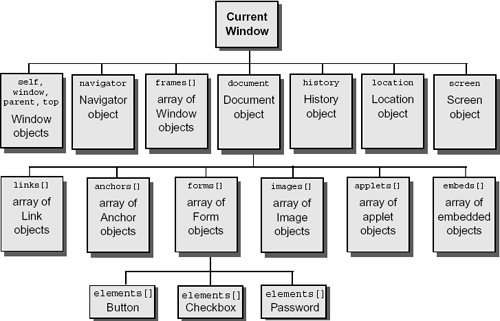

# Manipulação do DOM

# O que é DOM?

- **D**ocument **O**bject **M**odel é uma interface de programação para documentos `HTML` e `XML`.
- Sua função é permitir que programas alterem a estrutura, estilo e conteúdo de documentos.
- Sua representação se da por nós e objetos, forma de **árvore**. Com isso as linguagens de programação conseguem se conectar à página.



Exemplo do DOM

# O que são os objetos `window` e `document`?

## O objeto `window`

- Representa a janela de navegador.
- Todos os objetos globais JavaScript, funções e variáveis são membros da `window`.


O objeto `window`

## O objeto `document`

- Quandoo o documento HTML é carregado no navegador ele se torna um objeto, o `document`.
- O `document` é o nó raiz do documento HTML e uma propriedade do objeto `window`, portanto,  existem duas formas de acessar a ela:
    - `window.document`
    - `document`


O objeto `document`

# Diferença de `getElementById`, `getElementsByClassName`, `querySelector`, `querySelectorAll`

## `getElementById`

- Obtém o elemento com determinada `id`.

## `getElementsByClassName`

- Obtém **todos** elemento com determinada `classe`.

## `querySelector`

- Obtém o **primeiro** elemento com determinado seletor CSS.

## `querySelectorAll`

- Obtém **todos**  os elemento com determinado seletor CSS.

# O que é um `Element` no JavaScript?

- Representa a classe base mais geral de onde todos os outos objetos que representam elementos herdam.
- Possui apenas métodos e propriedades comunsa todos os tipos de elementos.
- Classes mais específicas herdam dele.

# Diferença de `innerHTML`, `innerText` e `textContent`

## `innerHTML`

- Utilizado na manipulação do DOM, o `innerHTML` retorna **todo o texto e o HTML que existem no elemento**.
- Retornando todo o HTML existente, inclusive as tags.

## `innerText`

- Retorna apenas o texto do elemento.
- Ignora todas as tags HTML que estão dentro do elemento, mas ainda assim, **entende** o css do elemento, retornando apenas textos visíveis.

## `textContent`

- Funciona de forma muito semelhante ao innerText, porém, retornando **todo o conteúdo de texto**, incluindo o texto oculto pelo css, bem como as quebras de linha (\n).

# Qual a diferença entre uma `NodeList` e uma array comum? Como transformar a `NodeList` em uma array?

- `nodeList` é uma coleção de nós do DOM extraídos do documento HTML.
- `array` é um tipo de dado no Javascript
- Para converter um `nodeList` em `array` pode-se usar o `spread operator`

```jsx
// create a `NodeList` object
const divs = document.querySelectorAll('div');

// convert `NodeList` to an array
const divsArr = [...divs];
```

# Como criar elementos via JavaScript com `document.createElement` e `element.appendChild`

- O primeiro cria um elemento o segundo popula um elemento adicionando ao final, caso exista ele é movido não duplicado.

# POC

[https://github.com/pullynnhah/1-poc-manipulacao-do-dom](https://github.com/pullynnhah/1-poc-manipulacao-do-dom)

[https://1-poc-manipulacao-do-dom.driven-paulaabro.com/](https://1-poc-manipulacao-do-dom.driven-paulaabro.com/)